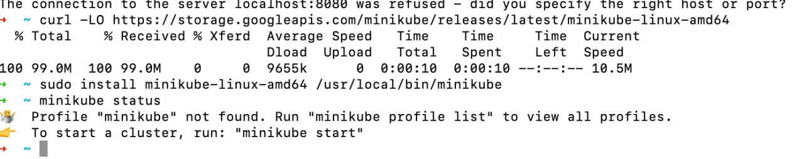
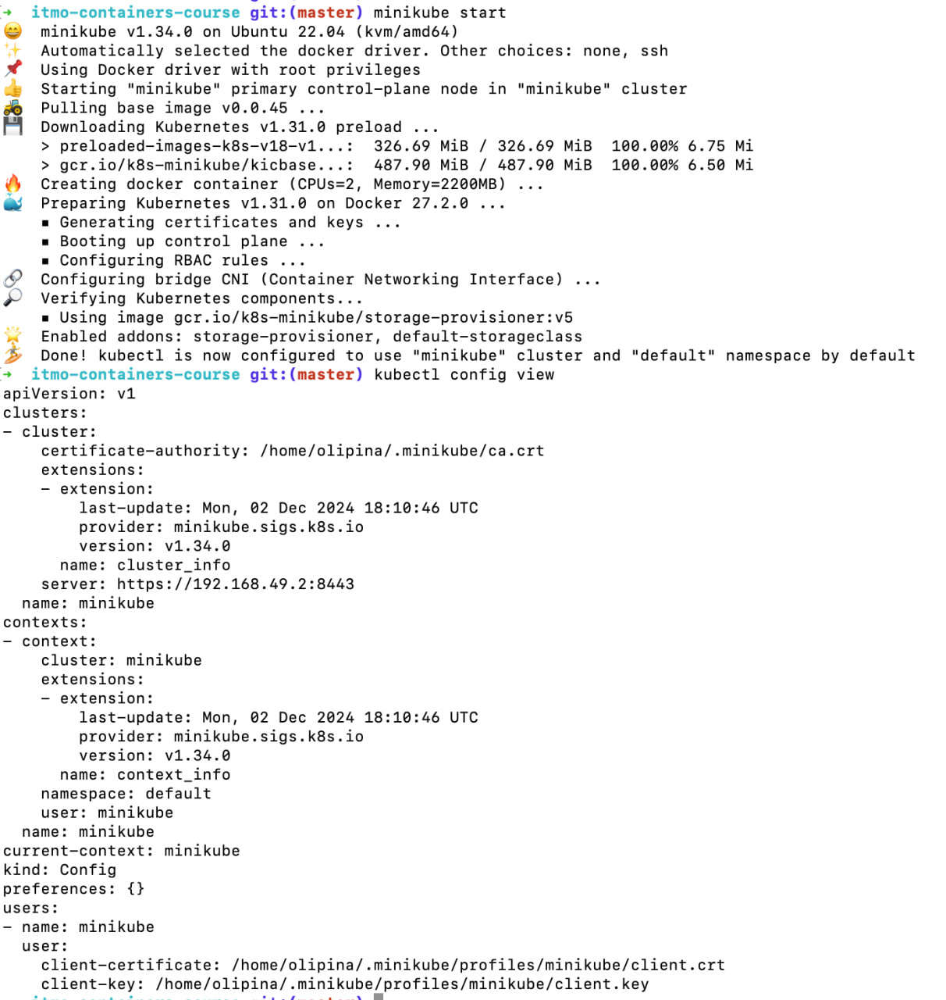
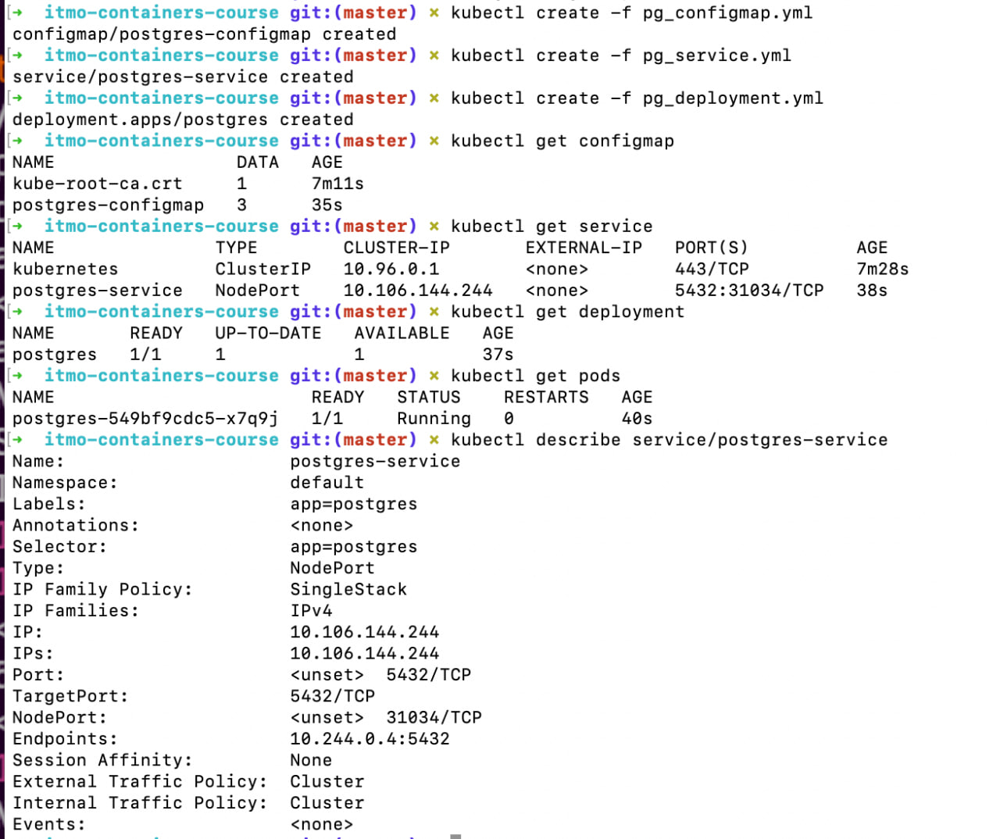
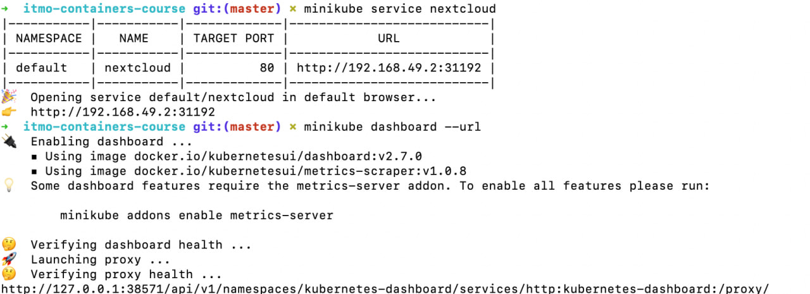
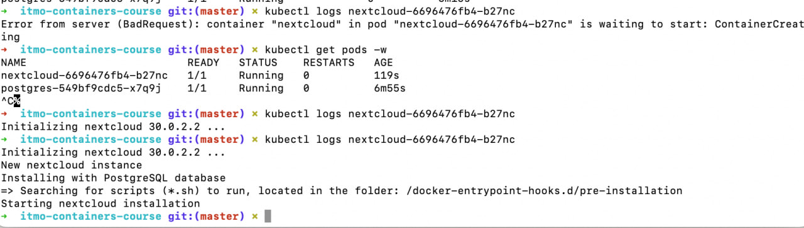
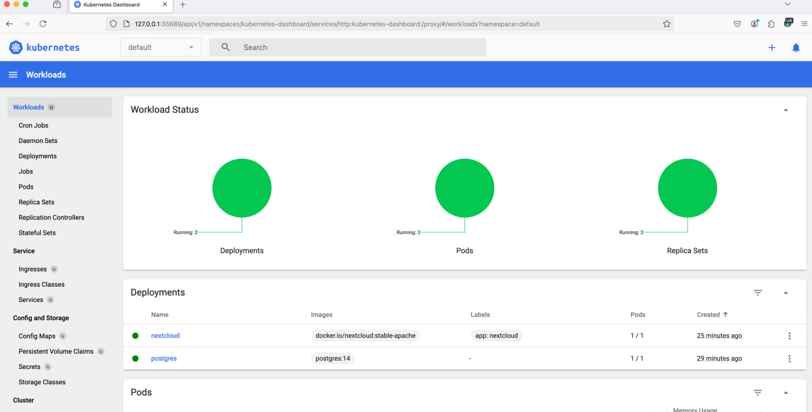
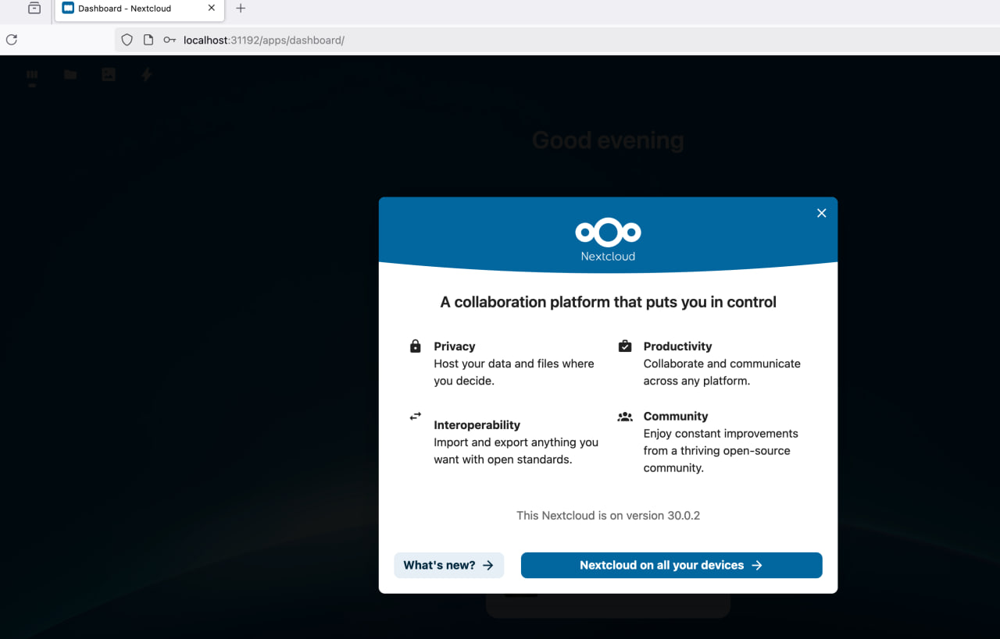
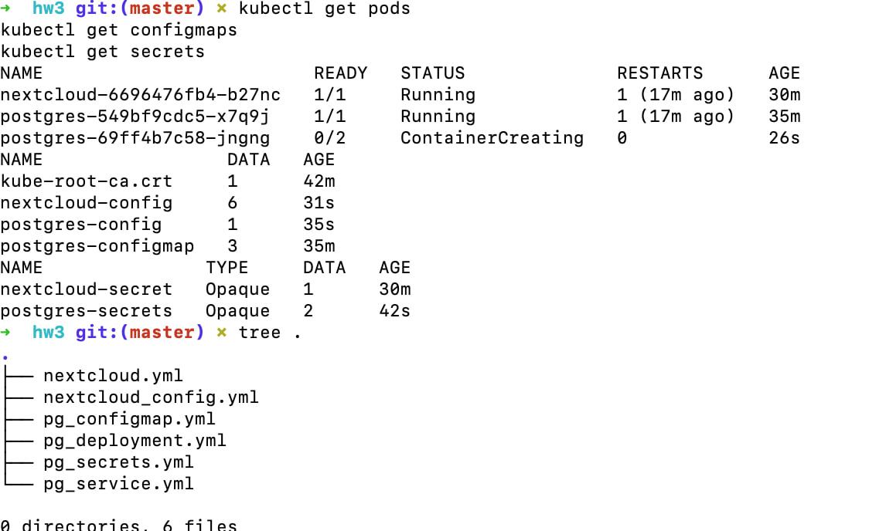

# Отчет по работе с Kubernetes

## 1. Ход работы

### Запуски, установки, порты

Установка minikube, kubectl, манифесты для postgresql и nextcloud.

## 2. Задание
Осуществлён:
- Перенос учетных данных PostgreSQL в Secret
- Конфигурация Nextcloud через ConfigMap
- Добавление Liveness/Readiness проб

## 3. Ответы на вопросы

### 3.1. Почему мы не можем сразу создать nextcloud deployment?
Nextcloud требует доступа к базе данных PostgreSQL. Без предварительно развернутой и настроенной базы данных, деплоймент Nextcloud не сможет корректно инициализироваться. Нажо сначала развернуть PostgreSQL и убедиться, что он готов принимать соединения.

### 3.2. Что такое Secrets? Что мы туда сохраняем и почему?
Secrets - это объект Kubernetes для хранения персональных доступов типа пароли, токены, ключи. Мы перенесли туда учетные данные PostgreSQL (POSTGRES_USER и POSTGRES_PASSWORD), потому что:
- Это чувствительная информация
- Secrets в Kubernetes хранятся в зашифрованном виде
- Доступ к Secrets можно ограничить через RBAC
- Отделение конфиденциальных данных от конфигурации улучшает безопасность

### 3.3. Что такое ConfigMap? Что мы туда сохраняем и почему?
ConfigMap - это объект Kubernetes для хранения неконфиденциальной конфигурационной информации. Мы сохраняем туда:
- Настройки базы данных (POSTGRES_DB)
- Параметры конфигурации Nextcloud (NEXTCLOUD_UPDATE, ALLOW_EMPTY_PASSWORD)
- Другие переменные окружения

Это позволяет:
- Отделить конфигурацию от кода
- Изменять настройки без пересборки образа
- Использовать одну конфигурацию для разных подов

### 3.4. Что такое Liveness и Readiness пробы, и для чего они нужны?
- Liveness probe проверяет, жив ли контейнер. Если не проходит, Kubernetes перезапускает контейнер.
- Readiness probe проверяет, готов ли под принимать трафик. Если не проходит, pod исключается из service endpoints.

В нашем случае обе пробы проверяют доступность /status.php, что позволяет:
- Автоматически перезапускать Nextcloud при сбоях
- Не отправлять трафик на неготовые поды
- Обеспечить корректную работу при обновлениях

