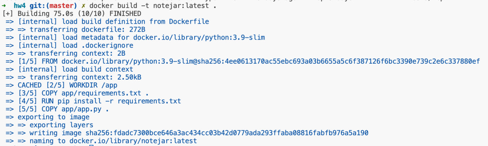
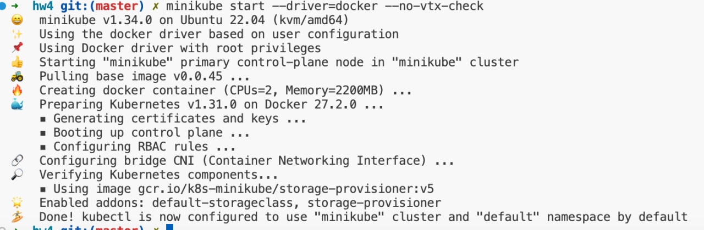
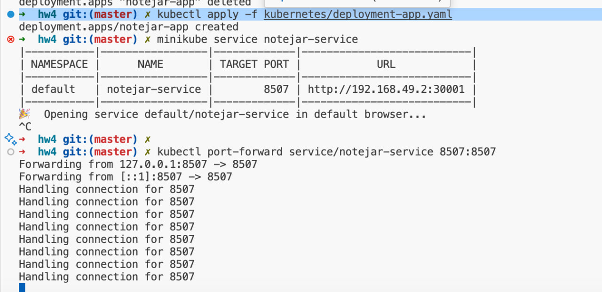
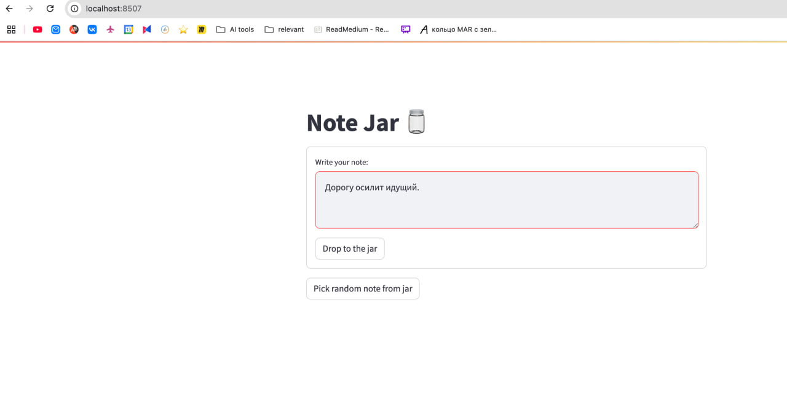

#  Ход работы
1. Сбилдим докер образ нашего веб-приложения notejar

2. Запустим миникуб

3. Закинем собранный образ в миникуб
```bash
>>> minikube image load notejar:latest
>>> minikube image list | grep notejar
docker.io/library/notejar:latest
```
4. Применим манифесты –конфигмапа и сикреты, подготовим хранилище для базы данных
```bash
# ConfigMap & Secret
kubectl apply -f kubernetes/configmap.yaml
kubectl apply -f kubernetes/secret.yaml

# Check
kubectl get configmap
kubectl get secret
```
Output:
```bash
NAME               DATA   AGE
app-config         2      7s
kube-root-ca.crt   1      8m49s
NAME              TYPE     DATA   AGE
postgres-secret   Opaque   3      7s
```

```bash
# configure storage
kubectl apply -f kubernetes/persistent-volume.yaml
kubectl apply -f kubernetes/persistent-volume-claim.yaml

# check if storage is ready
kubectl get pv
kubectl get pvc
```
```bash
NAME          CAPACITY   ACCESS MODES   RECLAIM POLICY   STATUS   CLAIM                  STORAGECLASS   VOLUMEATTRIBUTESCLASS   REASON   AGE
postgres-pv   1Gi        RWO            Retain           Bound    default/postgres-pvc   manual         <unset>                          10s
NAME           STATUS   VOLUME        CAPACITY   ACCESS MODES   STORAGECLASS   VOLUMEATTRIBUTESCLASS   AGE
```
5. Применим манифесты для деплоймента бд и веб-апп и сервисов

```bash
kubectl apply -f kubernetes/deployment-db.yaml
kubectl apply -f kubernetes/service-db.yaml

➜  hw4 git:(master) ✗ kubectl get pods -l tier=database

NAME                       READY   STATUS              RESTARTS   AGE
postgres-5dfbd85f7-smrqd   0/1     ContainerCreating   0          7s

➜  hw4 git:(master) ✗ kubectl get pods -l tier=database

NAME                       READY   STATUS    RESTARTS   AGE
postgres-5dfbd85f7-smrqd   1/1     Running   0          93s
```

```bash
# wwait for db pod to be ready
kubectl get pods -l tier=database


kubectl apply -f kubernetes/deployment-app.yaml
kubectl apply -f kubernetes/service-app.yaml
```

5. Проверим, что все поднялось
```bash
➜  hw4 git:(master) ✗ kubectl get pods
NAME                           READY   STATUS    RESTARTS   AGE
notejar-app-78545f78c6-4tshq   1/1     Running   0          13s
postgres-5dfbd85f7-5gvxk       1/1     Running   0          17m

# для дебага
kubectl get services

# для дебага
kubectl logs -l tier=frontend
kubectl logs -l tier=database

```
6. Посмотрим вживую
```bash
minikube service notejar-service
kubectl port-forward service/notejar-service 8502:8501
```


